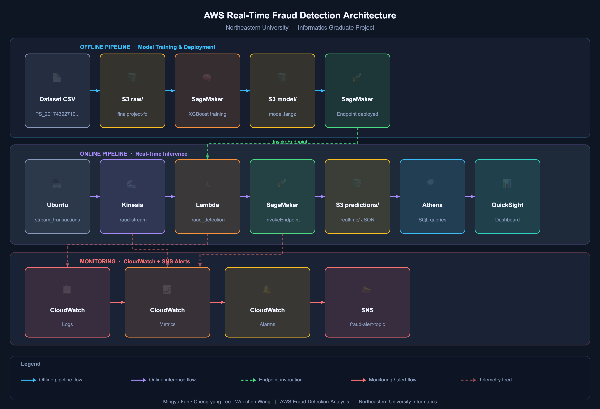

**[English](README.md) | [简体中文](README_zh_CN.md) | [繁體中文](README_zh_TW.md)**

# AWS Fraud Detection Analysis

A real-time fraud detection pipeline built on AWS, combining offline XGBoost model training with live transaction stream inference, automated alerting, and interactive visualization.

---

## Authors

**Mingyu Fan, Cheng-yang Lee, Wei-chen Wang** — Graduate Students, Informatics, Northeastern University  
Project Repository: [AWS-Fraud-Detection-Analysis](https://github.com/optimus889/AWS-Fraud-Detection-Analysis)

---

## Project Overview

This project implements an end-to-end fraud detection system using AWS managed services. A synthetic transaction dataset is used to train an XGBoost classifier on SageMaker. Live transactions are then streamed through Kinesis, scored by the deployed SageMaker endpoint via Lambda, and prediction results are stored in S3 for querying through Athena and visualization in QuickSight. CloudWatch monitors the pipeline and triggers SNS alerts when the fraud rate exceeds a defined threshold.

---

## Dataset

The raw dataset (`PS_20174392719_1491204439457_log.csv`, ~470 MB) exceeds GitHub's file size limit and is **not included in this repository**. It is stored in S3 and must be downloaded before running the pipeline.

**Download from S3:**

```bash
aws s3 cp s3://finalproject-fraud-detection/raw/PS_20174392719_1491204439457_log.csv \
    dataset/PS_20174392719_1491204439457_log.csv
```

> Make sure your AWS CLI is configured (`aws configure`) with credentials that have `AmazonS3FullAccess` or at minimum read access to the `finalproject-fraud-detection` bucket.

**Original source:** [PaySim Synthetic Financial Dataset — Kaggle](https://www.kaggle.com/datasets/ealaxi/paysim1)

---

## Architecture

 
 
### Offline Pipeline (Model Training)

```
PS_20174392719_1491204439457_log.csv
    └── S3 (raw/)
        └── SageMaker XGBoost Training
            └── SageMaker Endpoint
```

### Online Pipeline (Real-Time Inference)

```
Ubuntu Local Machine
    └── src/stream_transaction_7_days.py          # Simulate 7-day transaction window
        src/stream_transaction_custom_days.py    # Simulate custom date range
        src/stream_transaction_real_time.py      # Stream under current timestamp
        └── Kinesis (fraud-stream)
            └── Lambda (fraud_detection_lambda.py)
                └── SageMaker Endpoint
                    └── S3 (predictions/realtime/)
                        └── Athena
                            └── QuickSight
```

### Monitoring

```
CloudWatch
    ├── Logs     — Lambda execution logs, SageMaker inference latency
    ├── Metrics  — Fraud rate, Kinesis stream throughput, endpoint invocations
    └── Alarms   → SNS Topic (fraud-alert-topic)
```

---

## AWS Services Used

| Service | Role |
|---|---|
| **Amazon Kinesis** | Real-time transaction data ingestion (`fraud-stream`); capacity mode: **on-demand**; max capacity: **10,240 KiB** |
| **AWS Lambda** | Batch inference trigger on each Kinesis shard record |
| **Amazon SageMaker** | XGBoost model training (`ml.m5.large`) and hosted real-time endpoint |
| **Amazon S3** | Storage for raw data, processed splits, model artifacts, and predictions |
| **Amazon Athena** | SQL-based querying over S3 prediction results |
| **Amazon QuickSight** | Interactive fraud analytics dashboard |
| **Amazon CloudWatch** | Logs, metrics, and alarms for pipeline monitoring |
| **Amazon SNS** | Alert notifications to `fraud-alert-topic` when fraud rate is exceeded |

---

## Model Details

| Item | Value |
|---|---|
| **Algorithm** | SageMaker Built-in XGBoost 1.7-1 |
| **Objective** | `binary:logistic` |
| **Eval Metric** | AUC |
| **Boosting Rounds** | 120 |
| **Training Instance** | `ml.m5.large` |
| **Inference Threshold** | 0.5 |
| **Test Accuracy** | 0.9980 |
| **Test Precision** | 0.9718 |
| **Test Recall** | 0.9789 |
| **Test F1-score** | 0.9753 |
| **Test ROC-AUC** | 0.9992 |

### Feature Vector (11 features, order-sensitive)

| # | Feature | Type |
|---|---|---|
| 1 | `step` | int |
| 2 | `amount` | float |
| 3 | `oldbalanceOrg` | float |
| 4 | `newbalanceOrig` | float |
| 5 | `oldbalanceDest` | float |
| 6 | `newbalanceDest` | float |
| 7 | `type_CASH_IN` | int (one-hot) |
| 8 | `type_CASH_OUT` | int (one-hot) |
| 9 | `type_DEBIT` | int (one-hot) |
| 10 | `type_PAYMENT` | int (one-hot) |
| 11 | `type_TRANSFER` | int (one-hot) |

---

## IAM Role & Policy Requirements

Configure the following IAM roles in the AWS Console before running the project.

### 1. Local Machine — IAM User

Go to **IAM → Users → your user → Add permissions → Attach policies directly**:

| Managed Policy | Purpose |
|---|---|
| `AmazonS3FullAccess` | Upload raw data and read model artifacts from S3 |
| `AmazonKinesisFullAccess` | Put records to `fraud-stream` |
| `AmazonSageMakerFullAccess` | Submit training jobs and invoke endpoint |

### 2. SageMaker Execution Role

Go to **IAM → Roles → Create role → AWS service → SageMaker**:

| Managed Policy | Purpose |
|---|---|
| `AmazonSageMakerFullAccess` | Training, model, and endpoint management |
| `AmazonS3FullAccess` | Read raw/processed data, write model artifacts |
| `CloudWatchLogsFullAccess` | Write training logs to CloudWatch |

### 3. Lambda Execution Role

Go to **IAM → Roles → Create role → AWS service → Lambda**:

| Managed Policy | Purpose |
|---|---|
| `AmazonKinesisFullAccess` | Read records from `fraud-stream` |
| `AmazonSageMakerFullAccess` | Invoke SageMaker inference endpoint |
| `AmazonS3FullAccess` | Write prediction results to `predictions/` |
| `CloudWatchLogsFullAccess` | Write Lambda execution logs |

### 4. CloudWatch & SNS

Go to **IAM → Roles → your CloudWatch role → Add permissions**:

| Managed Policy | Purpose |
|---|---|
| `CloudWatchFullAccess` | Create alarms, metrics, and dashboards |
| `AmazonSNSFullAccess` | Publish fraud rate alerts to `fraud-alert-topic` |

---

## S3 Bucket Structure

**Bucket:** `finalproject-fraud-detection`

```
finalproject-fraud-detection/
├── raw/                        # Source dataset CSV
├── processed/
│   ├── train/                  # Training split (70%)
│   ├── validation/             # Validation split (15%)
│   └── test/                   # Test split (15%)
├── predictions/
│   ├── realtime/               # Per-transaction Lambda inference output (JSON)
│   └── offline-endpoint-check/ # Endpoint verification results (CSV)
├── model/
│   ├── training-output/        # SageMaker training job output
│   └── xgboost/                # Copied model artifact (model.tar.gz)
└── Athena-results/             # Athena query output files
```

---

## Repository Structure

```
AWS-Fraud-Detection-Analysis/
├── architecture/
│   └── aws-fraud-detection-architecture.png     # AWS architecture diagram
├── dashboard/
│   └── dashboard_demo.pdf                        # QuickSight dashboard demo export
├── dataset/                                      # Offline-generated transaction datasets 
├── lambda/
│   └── fraud_detection_lambda.py                 # Lambda handler: decode → feature build → batch infer → S3 write
├── model/                                        # Offline-trained model artifacts
│   └── Training Model and Deploy.ipynb           # SageMaker training, evaluation, and deployment notebook
├── sql/
│   └── athena_queries.sql                        # Athena SQL query scripts
├── src/
│   ├── stream_transaction_7_days.py              # Simulate a fixed 7-day transaction window → Kinesis
│   ├── stream_transaction_custom_days.py         # Simulate a user-defined date range → Kinesis
│   └── stream_transaction_real_time.py           # Stream transactions under the current timestamp → Kinesis
├── README.md
└── requirements.txt
```

---

## Ubuntu Linux Environment Setup

This section covers all AWS-related configuration steps required on your local Ubuntu machine before running the pipeline.

### 1. Install AWS CLI v2

```bash
# Download and install AWS CLI v2
curl "https://awscli.amazonaws.com/awscli-exe-linux-x86_64.zip" -o "awscliv2.zip"
unzip awscliv2.zip
sudo ./aws/install

# Verify installation
aws --version
# Expected output: aws-cli/2.x.x Python/3.x.x Linux/...
```

### 2. Configure AWS Credentials

```bash
aws configure
```

You will be prompted to enter the following:

```
AWS Access Key ID [None]:      <your-iam-user-access-key-id>
AWS Secret Access Key [None]:  <your-iam-user-secret-access-key>
Default region name [None]:    us-east-1
Default output format [None]:  json
```

> Credentials are saved to `~/.aws/credentials` and region/output settings to `~/.aws/config`.  
> The IAM user must have `AmazonS3FullAccess`, `AmazonKinesisFullAccess`, and `AmazonSageMakerFullAccess` attached (see IAM section above).

**Verify credentials are working:**

```bash
aws sts get-caller-identity
```

Expected output:

```json
{
    "UserId": "AIDAXXXXXXXXXXXXXXXXX",
    "Account": "123456789012",
    "Arn": "arn:aws:iam::123456789012:user/your-iam-username"
}
```

### 3. Verify S3 Access

```bash
# List all buckets
aws s3 ls

# Confirm the project bucket is accessible
aws s3 ls s3://finalproject-fraud-detection/
```

### 4. Verify Kinesis Access

```bash
# Confirm fraud-stream exists and is active
aws kinesis describe-stream-summary --stream-name fraud-stream
```

Expected output includes `"StreamStatus": "ACTIVE"`.

### 5. Verify SageMaker Endpoint Access

After deploying the endpoint (Step 3 in Getting Started), confirm it is reachable from your local machine:

```bash
aws sagemaker describe-endpoint --endpoint-name <your-endpoint-name>
```

Expected output includes `"EndpointStatus": "InService"`.

### 6. Set Up Python Virtual Environment

```bash
# Create and activate virtual environment
python3 -m venv venv
source venv/bin/activate

# Install dependencies
pip install -r requirements.txt
```

> Python 3.10 or higher is required. If your system default is older, install via:
> ```bash
> sudo apt update && sudo apt install -y python3.10 python3.10-venv python3-pip
> ```

### 7. Sync System Clock (Important)

AWS request signing requires your system clock to be accurate. Clock skew will cause `InvalidSignatureException` errors.

```bash
# Install and sync time via NTP
sudo apt update && sudo apt install -y chrony
sudo systemctl enable chrony
sudo systemctl start chrony

# Verify sync status
chronyc tracking
```

The `System time` offset shown should be well under 1 second.

### 8. Environment Variable Reference (Optional)

To avoid passing credentials on the command line, you can export them as environment variables in your shell session:

```bash
export AWS_ACCESS_KEY_ID="your-access-key-id"
export AWS_SECRET_ACCESS_KEY="your-secret-access-key"
export AWS_DEFAULT_REGION="us-east-1"

# Project-specific variables used by streaming scripts
export KINESIS_STREAM_NAME="fraud-stream"
export PREDICTION_BUCKET="finalproject-fraud-detection"
export ENDPOINT_NAME="sagemaker-xgboost-2026-03-13-23-05-26-528"
```

> Environment variables take precedence over `~/.aws/credentials`. Remove them or use `unset` to revert to the credentials file.

---

## Getting Started

### Prerequisites

- Ubuntu 24.04
- Python 3.10+
- AWS CLI configured (`aws configure`) with IAM user credentials
- AWS services enabled: Kinesis, SageMaker, Lambda, S3, Athena, QuickSight, CloudWatch, SNS

### Installation

```bash
git clone https://github.com/optimus889/AWS-Fraud-Detection-Analysis.git
cd AWS-Fraud-Detection-Analysis
python3 -m venv venv
source venv/bin/activate
pip install -r requirements.txt
```

### Step 1 — Download Dataset from S3

The raw dataset is stored in S3 and must be downloaded locally before running the notebook:

```bash
aws s3 cp s3://finalproject-fraud-detection/raw/PS_20174392719_1491204439457_log.csv \
    dataset/PS_20174392719_1491204439457_log.csv
```

### Step 2 — Train Model (SageMaker Notebook)

Open and run `model/Training Model and Deploy.ipynb` in a SageMaker Notebook instance. The notebook will:

1. Download the raw CSV from `S3 (raw/)` and preprocess it with chunk-based reading
2. One-hot encode transaction types and downsample non-fraud records (3% sample)
3. Split into train / validation / test and upload to `S3 (processed/)`
4. Launch a SageMaker XGBoost training job on `ml.m5.large`
5. Evaluate the model on the test set (ROC-AUC ≈ 0.9992)

### Step 3 — Deploy SageMaker Endpoint

Continue in `model/Training Model and Deploy.ipynb` to deploy the trained model:

```python
predictor = xgb.deploy(
    initial_instance_count=1,
    instance_type="ml.m5.large",
    serializer=CSVSerializer(),
    deserializer=JSONDeserializer()
)
```

Note the deployed endpoint name (e.g. `sagemaker-xgboost-2026-03-13-23-05-26-528`) for use in the Lambda configuration.

### Step 4 — Configure Lambda Function

1. In the AWS Console, create a Lambda function using the code in `lambda/fraud_detection_lambda.py`
2. Set the following environment variables:

| Key | Value |
|---|---|
| `ENDPOINT_NAME` | Your deployed SageMaker endpoint name |
| `PREDICTION_BUCKET` | Your Bucket Name |
| `PREDICTION_PREFIX` | `predictions/realtime` |

3. Configure the following Lambda resource settings:

| Setting | Value |
|---|---|
| **Memory** | 1024 MB |
| **Timeout** | 5 minutes (300 seconds) |

4. Add a Kinesis trigger pointing to `fraud-stream`
5. Attach the Lambda execution role defined in the IAM section above

### Step 5 — Start Real-Time Stream

Choose one of the following streaming scripts depending on your use case:

| Script | Description |
|---|---|
| `stream_transaction_7_days.py` | Streams a simulated 7-day transaction window to `fraud-stream` |
| `stream_transaction_custom_days.py` | Streams transactions over a user-defined date range to `fraud-stream` |
| `stream_transaction_real_time.py` | Streams transactions timestamped to the current time to `fraud-stream` |

```bash
# Option A: Fixed 7-day window
python3 src/stream_transaction_7_days.py

# Option B: Custom date range
python3 src/stream_transaction_custom_days.py

# Option C: Current real-time timestamps
python3 src/stream_transaction_real_time.py
```

Each script reads the raw CSV from S3, builds a balanced pool (20% fraud, 80% normal by default), and streams transactions to `fraud-stream`. Lambda processes each batch, invokes the SageMaker endpoint, and writes per-transaction JSON results to `s3://finalproject-fraud-detection/predictions/realtime/`.

### Step 6 — Query Results with Athena

Run the SQL scripts in `sql/athena_queries.sql` against the predictions bucket. Results are saved to `s3://finalproject-fraud-detection/Athena-results/`.

### Step 7 — Visualize with QuickSight

Connect QuickSight to the Athena data source and explore fraud metrics interactively. A sample dashboard export is available in `dashboard/dashboard_demo.pdf`.

### Step 8 — Monitor with CloudWatch & SNS

CloudWatch collects Lambda execution logs, Kinesis stream throughput, and SageMaker endpoint invocation metrics. Configure an alarm to trigger an SNS notification to `fraud-alert` when the fraud rate exceeds your defined threshold.

---

## License

This project is for academic and educational purposes.